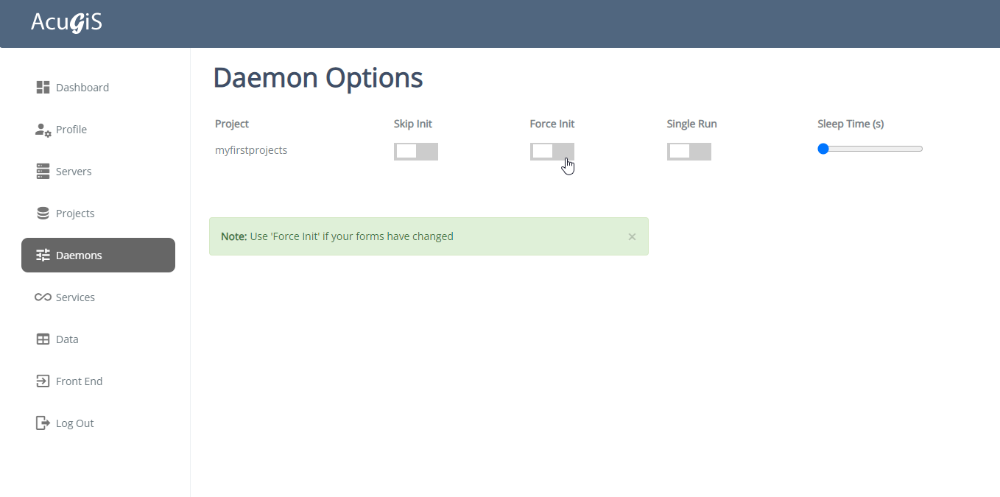

Daemons
=====

The Daemon page is used the set the Service options.

Options
------------

There are four options for Daemons, as shown below:

Skip Init:  Use Skip Init to skip the initialization of syncronization. 

Force Init: Force Init will drop the PostGIS schema and reinitialize the Project in the database.

Single Run: Peform a single run.

Sleep Time:  The Frequency determines how often the service syncronizes.  By default, this is every 10 seconds.  You can adjust this interval here using the slide.

NOTE: You must restart the instance for the above changes to take effect.

