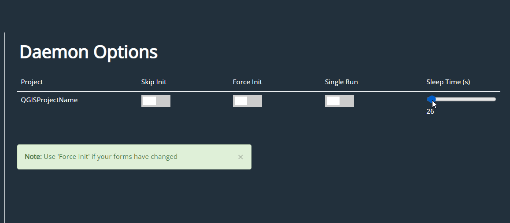

Daemons
=====

.. _installation:

Installation
------------

To use Lumache, first install it using pip:

Creating recipes
----------------

now
Dashboard.png
images
now
daemons.png
images
now
data-1.png
images
now
data-2.png
images
now
data-3.png
images
now
data-4.png
images
now
geoserver-1.png
images
now
groups.png
images
now
project-1.png
images
now
project-2.png
images
now
project-3.png
images
now
servers.png
images
now
services.png
images
now
users.png

To retrieve a list of random ingredients,
you can use the ``lumache.get_random_ingredients()`` function:

.. autofunction:: lumache.get_random_ingredients

The ``kind`` parameter should be either ``"meat"``, ``"fish"``,
or ``"veggies"``. Otherwise, :py:func:`lumache.get_random_ingredients`
will raise an exception.

.. autoexception:: lumache.InvalidKindError

For example:

>>> import lumache
>>> lumache.get_random_ingredients()
['shells', 'gorgonzola', 'parsley']

