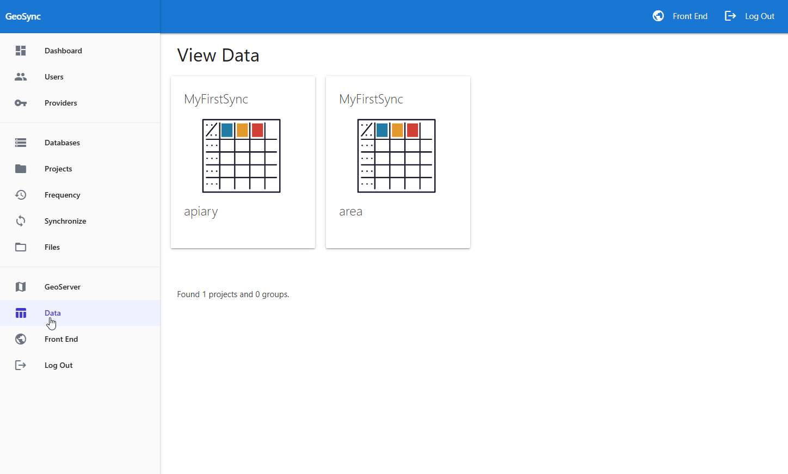
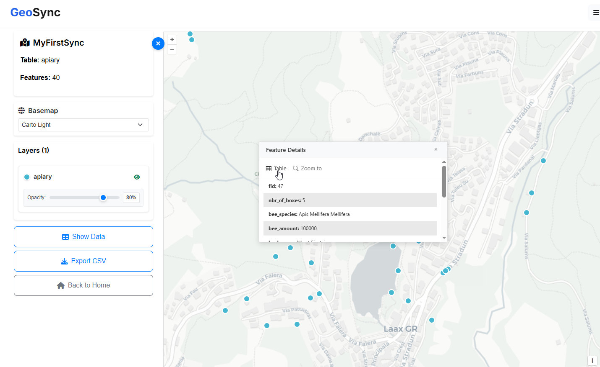

Data
=====

The Data page proivdes a way to quickly view Project data in both tabular and map formats.

It is particularly usefule for verifying updates as well as simple access to data.

Usage
------------

On the Data page, click the Project you wish to view as shown below

The data is displayed as a map and can also be opened in table format.  

You can also export to CSV using the left menu.

Multiple GeoPackages
------------

A data link will be displayed for each GeoPackage contained in a Project.

